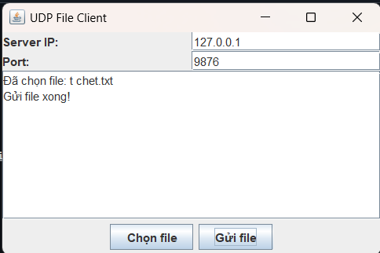
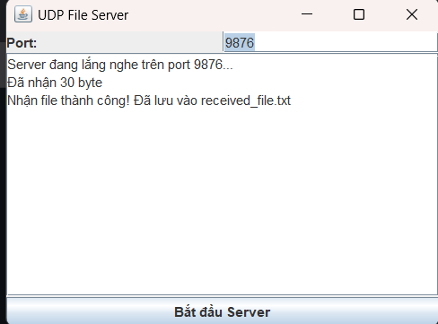
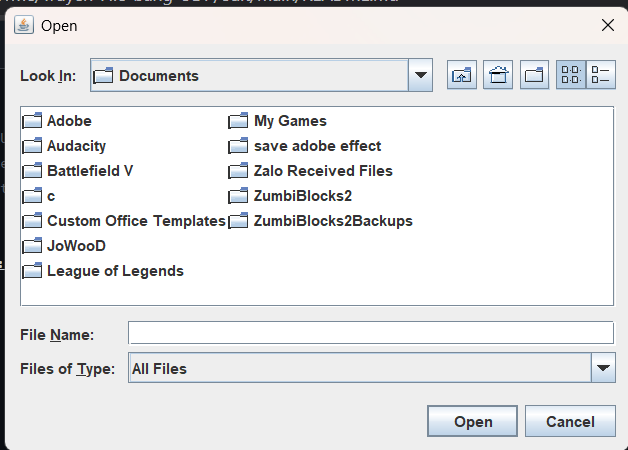

<h2 align="center">
    <a href="https://dainam.edu.vn/vi/khoa-cong-nghe-thong-tin">
    🎓 Faculty of Information Technology (DaiNam University)
    </a>
</h2>
<h2 align="center">
TRUYỀN DẪN FILE BẰNG UDP
</h2>

    

        
        
        
    

## 📖 1. Giới thiệu
Trang bị cho sinh viên hiểu về cách thức kết nối cơ bản của UDP từ client tới server bằng cách gửi 1 file txt có sẵn text trong đó đến server sẽ nhận file , tạo và lưu trữ vào trong code

### 🎯 Mục tiêu hệ thống
- Nghiên cứu lý thuyết về giao thức UDP và so sánh với TCP.
- Hiểu rõ cách thức hoạt động của UDP trong việc truyền tải dữ liệu.
- Xây dựng chương trình Client – Server bằng ngôn ngữ Java để gửi và nhận file .
- Vận dụng kiến thức về lập trình socket trong Java.

## 🔧 2. Ngôn ngữ lập trình sử dụng: 

**Java**: Ngôn ngữ lập trình chính, sử dụng gói `java.net` để xử lý **DatagramSocket** và **DatagramPacket** (UDP), cùng với `java.io` để đọc/ghi file. Phiên bản **Java 8 trở lên** được khuyến nghị để đảm bảo tương thích.  

**UDP Socket**: Giao thức cốt lõi, **không kết nối (connectionless)**, truyền dữ liệu theo gói (datagram), tốc độ nhanh, không đảm bảo thứ tự và độ tin cậy như TCP. Phù hợp cho truyền file nhỏ, ứng dụng chat, hoặc game thời gian thực.  

**JDK (Java Development Kit)**: Phiên bản 8 trở lên để biên dịch và chạy code Java. Hỗ trợ sẵn các API mạng (`java.net`) và IO (`java.io`).  

**IDE (Môi trường phát triển)**: Có thể dùng **VS Code** (với extension *Extension Pack for Java*) hoặc **Eclipse**. IDE giúp compile, debug và chạy Java dễ dàng.  

**GitHub**: Nền tảng lưu trữ và chia sẻ repo Git online để hợp tác làm việc nhóm.  

**Git**: Công cụ quản lý phiên bản phân tán, giúp theo dõi và quay lại lịch sử code.  

---

### Môi trường chạy  

- **JDK**: Phiên bản 8 trở lên để biên dịch và chạy chương trình Java.  
- **VS Code / Eclipse**: IDE để biên dịch, debug và chạy ứng dụng Java.

##   3 Hình ảnh các chức năng 

  
  
1: Server

  
  
2: Client

  
  
3: Chọn file đưa vào Client

## 🚀 4. Hướng dẫn chạy

Biên dịch chương trình:

javac *.java

Chạy server trước:

java Server

Chạy client để gửi hoặc nhận dữ liệu:

java Client

##  5. Liên hệ 
**Họ tên**: Nguyễn Cao Tùng.  
**Lớp**: CNTT 16-03.  
**Email**: nguyentungxneko@gmail.com.

© 2025 AIoTLab, Faculty of Information Technology, DaiNam University. All rights reserved.

---
